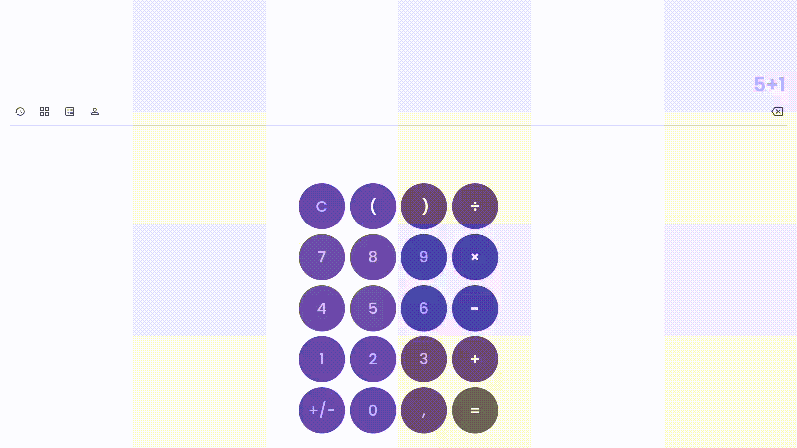
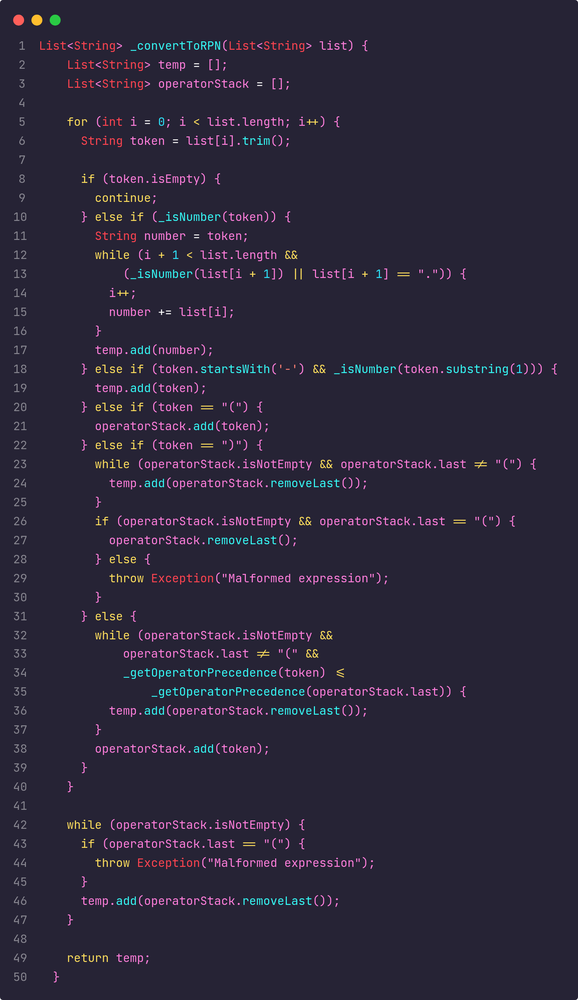

# Calculadora Notação Polonesa (RPN) 🧮

Bem-vindo à documentação da Calculadora Notação Polonesa (RPN). Esta calculadora é projetada para realizar operações matemáticas usando a notação polonesa reversa, sendo multiplataforma.



---

## Menu

- [Sobre o Projeto](#sobre-o-projeto)
- [Tecnologias Utilizadas](#tecnologias-utilizadas)
- [Estrutura de Pastas (MVC)](#estrutura-de-pastas-mvc)
- [Próximas Atualizações](#próximas-atualizações)
- [Como Usar](#como-usar)
- [Destaques](#destaques)
- [Contribuição](#contribuição)
- [Redes Sociais](#redes-sociais)
- [Licença](#licença)
- [Autor](#autor)

---

## Sobre o Projeto

Esta calculadora vai além de uma aplicação matemática convencional. É um aprofundamento na estrutura de dados da Pilha (Stack) e no mundo da Notação Polonesa Reversa (RPN). A RPN é uma forma inovadora de escrever expressões matemáticas, onde os operadores são colocados após seus operandos, eliminando a necessidade de parênteses e regras de precedência complexas.

### Pilhas e Notação Polonesa Reversa (RPN)

A **pilha** é a estrutura de dados central desta calculadora. Ela segue a regra **"último a entrar, primeiro a sair" (LIFO)**, fundamental para as operações RPN. Números e operadores são empilhados e desempilhados eficientemente, tornando o cálculo mais fácil sem se preocupar com a ordem das operações.

### Conversão de Expressões para RPN

A funcionalidade central desta calculadora é a capacidade de converter expressões matemáticas padrão em RPN. A transformação da notação infix (padrão) para postfix (RPN) acontece de forma eficiente usando pilhas. Cada operador segue diretamente seus operandos, eliminando complexidades de precedência.

## Tecnologias Utilizadas


## Estrutura de Pastas (MVC)

Este projeto segue a arquitetura Model-View-Controller (MVC) para organização do código. A estrutura de pastas é:

- **`model`:** Contém a implementação da estrutura de pilha (Model) em `calculator.model.dart`.
  
- **`view`:** Responsável pela interface do usuário. `calculator.dart` contém a interface principal do aplicativo.

- **`controller`:** Gerencia a lógica de controle e comunica com o modelo. `calculator.controller.dart` gerencia os dados e comunica com a model.

- **`main.dart`:** Ponto de entrada do aplicativo Flutter.

## Próximas Atualizações

Estamos trabalhando para adicionar funcionalidades incríveis:

- [ ] **Calculadora Científica:** Adição de funções como trigonometria e logaritmos.
  
- [ ] **Conversão de Medidas e Moedas:** Capacidade de converter diferentes unidades.
  
- [ ] **Divisão de Contas:** Compartilhe contas e resultados facilmente.
  
- [ ] **Histórico de Operações:** Visualize um histórico das operações realizadas.

## Como Usar

1. **Instale o projeto na sua máquina** usando o git clone

```bash
git clone https://github.com/GUSTAV0DEDEUS/Calculator.git
```

2. **Acesse a pasta** através do file ou pelo prompt de comando

```bash
cd Calculator
```

3. **Rode a aplicação** com o Flutter configurado na sua máquina basta executar o projeto com o comando

```bash
flutter run
```

4. **Digite a Expressão:** Insira sua expressão matemática
  
5. **Pressione o Sinal de Igual:** Veja o resultado instantaneamente.

## Destaques



## Contribuição

Sinta-se à vontade para contribuir para o desenvolvimento deste projeto ou reportar problemas. Abra uma issue ou envie um pull request para o [repositório no GitHub](https://github.com/GUSTAV0DEDEUS/Calculator).

## Redes Sociais

[](https://www.linkedin.com/in/gustavo-de-deus-conceicao/)
[](https://github.com/GUSTAV0DEDEUS)
[](https://www.instagram.com/decode0001/)
<a href="https://www.youtube.com/@deCode001">
  
</a>

## Licença

Este projeto é licenciado sob a [Licença MIT](./LICENSE).

---


## Autor

Gustavo De Deus Conceição (Desenvolvedor Fullstacks)